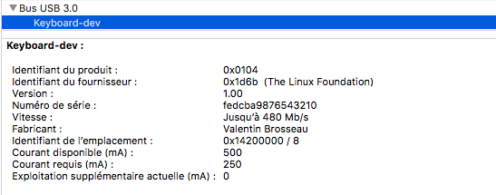

# Pi-as-keyboard

Make your Raspberry Pi act like a Keyboard via HID emulation.

The main purpose of this script is to make the Pi emulate a keyboard when connected to a computer.

## Information

This project is voluntary work and is small and simple designed to be used as a base for more complex projects (like hot keyboard remapping, etc)

This has been tested on my Raspberry Pi Zero W with Rasbian Buster the 18/04/2020

## WARNING

⚠️️⚠️️Do not connect the Pi using the power connector. Use the data port instead. 

## Kernel Warning

Since 2017 the default Kernel on the Rpi W seems broken with keyboard emulation. To fix the problem upgrade to the latest version with the ```rpi-update``` command (not installed by default)

## Install

On the Pi and run the setup script.

```sh
$ sudo ./setup.sh
$ sudo reboot
```



## Test the setup

This script will send scancodes to the computer connected to the Pi.

```
$ sudo ./test.sh
```
